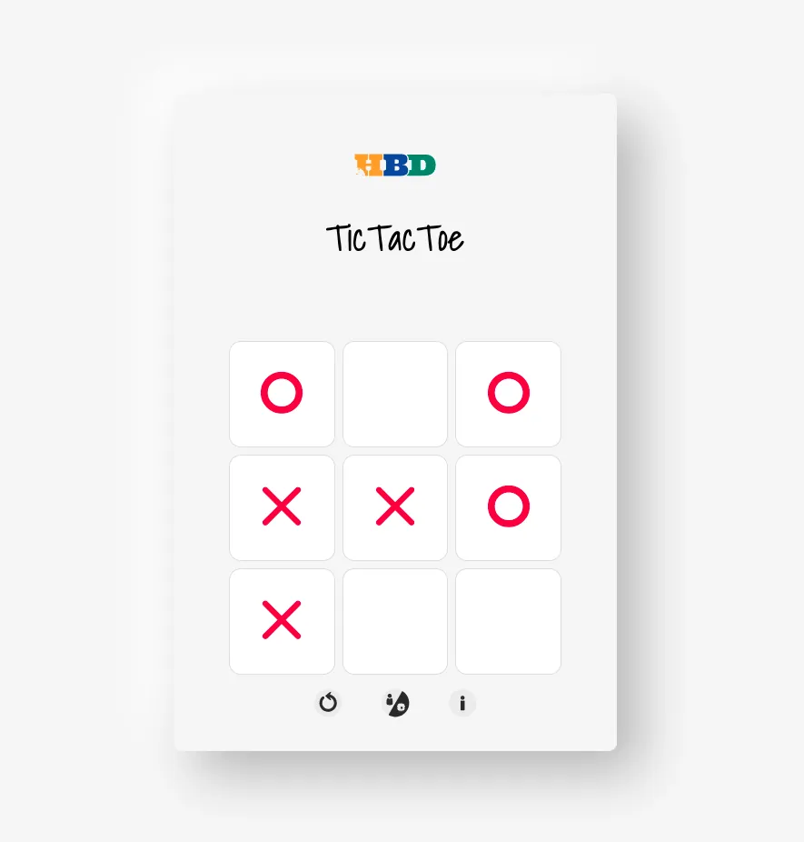

# TicTacToe v2

## Play online!

Here's the [link](https://hungrybluedev.github.io/tictactoe2/) to the PWA.

## Motivation

This is the second iteration of my attempt at the classic TicTacToe. I have a [YouTube playlist](https://www.youtube.com/playlist?list=PLZIV8woTBPyaIk2ea5GgIulS1h6mKRxp9) outling the development process. This was my [first attempt](https://github.com/hungrybluedev/hbd-tictactoe).

I created this project to teach myself several topics:

1. Web UI/UX design and development
2. Progressive Web App (PWA) development
3. Typescript
4. Sass
5. Artificial Intelligence (CPU opponent)
6. Video Editing (YouTube)

## Features

This is a [PWA (Progressive Web App)](https://web.dev/what-are-pwas/). Because of this fact, there are several benefits.

### Installable

Once you navigate to the [link for this PWA](https://hungrybluedev.github.io/tictactoe2/), you will get a prompt to install the app on your device (on phones as well as PCs). Once you install it, you can search your app list and find this app quickly. There will be no need to re-type the URL.

### Works offline

For an app to be a PWA, it must have at least one service worker for handling requests when offline. This project has that. So even if you're disconnected, you can use this app freely.

### CPU opponent

This game has a Player vs CPU mode (PvC). Focus on the three buttons at the bottom below the playable area. Click/tap on the button in the middle. This will the toggle the mode between Player vs Player (PvP) and the PvC mode. The default mode is PvC.

It is not the smartest CPU player; it can be bested. But it is functional and can defeat you if you are not careful. Have fun!

## Troubleshooting

If you're missing any new feature that I've added, try clearing your history and cache.
The site should redownload and work as intended.
If it still doesn't work, contact me [@hungrybluedev](https://hungrybluedev.in/contact/).

If you notice a bug, consider creating an issue and if possible, a pull-request linked to that issue. If the fix is good to go, I'll merge it!

## License

Copyright &copy; Subhomoy Haldar - Hungry Blue Dev

Licensed under the [MIT License](LICENSE).

## Support

You can buy me a coffee at [Ko-fi](https://ko-fi.com/hungrybluedev). Or you can support me on [Patreon](https://www.patreon.com/bePatron?u=24185563) on a monthly basis.

<a href="https://patreon.com/hungrybluedev">
  

